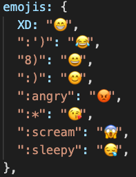

### Requirements to run application

- node.js, installed over https://nodejs.org/en/
- flask, for server backend (pip install flask)
- flask-cors, for cross communcation frontend - backend (pip install Flask-Cors)
- pusher, API for real-time features (pip install pusher) documentation https://pusher.com/ 

### How to run application

1. Start by navigating into **find-a-friend** folder in terminal type  ``npm run serve`` for frontend
2. navigate into **flask_backend** folder run ``app.py`` for backend
3. they will both run seperately.
4. open web browser go to **localhost:8080**

### Application Functionalities

NOTE: The application is developed using Pusher API (documentation https://pusher.com/), which is an API that can be used to make real-time features like chat or sending friend requests. Requires to have multiple tabs open to see it in action.

#### All Friends page (not logged in)

* Display all registered friends
  * Details button for viewing more details about the chosen friend.
* Refresh button to refetch.
* Filter section
  * Search-bar display on firstname input, input is stored in storageSession, and will remain if the user leaves the route and revisits (/friends) route
  * checkboxes to filter friends based on hobbies.

#### Login page

##### Already registered users detail that can be used
**email: test@live.no pw: test123** 
 
**email: tony@live.no pw: tony123**
 
**email: ola@hotmail.com pw: ola123**
 
**email: test2@hlive.no pw: test123**

* Form for logging in
   * Email is not case-sensitive, but password is.
   * Entering a non valid input (eg. not including @) displays error from frontend.
   * Entering a non valid input that is not registered displays error from server.

* Same applies for signup
  * in addition entering an email that is already registered/used , displays error.

#### Profile page (Logged in, registered as Friend)

* can upload images to gallery for others users to see when they visit detail page.
* delete image clicking on an image that are uploaded.
* edit profile. Edit description, change hobbies and change profile image based on images that are uploaded.
    * not selecting image results in removing current profile image and gives default image. 

#### All Friends page (Logged In, not registered as Friend) 

* Login into ``email: ola@hotmail.com pw: ola123`` or signup as new user

* Can register as Friend
  * register as friend form firstname, lastname, desc, hobbies must not be empty, error from frontend.
  * register as friend with firstname that is already taken, error.
  * can Add new hobby if hobby you wish is not listed.
    * Trying to add a hobby that already exists , gives error
  * Profile image (optional) accepted formats (jpeg,jpg,png, gif) other formats, gives error

#### All Friends page (Logged In, registered as Friend)

* Toggle button to show New Friends or show My friends
   * New Friends
     * Send friend request, trying to send multiple to same person, gives error.
        * Friend that recieves request will in real-time recieve the request. open new tab and log into the user that you want to send request to and on Request navbar will update real-time. (can be seen being on the request nav route or not) 
     * View details
    * My Friends
      * Chat real-time
        * All chats are private messages (1 to 1 relation) and stored in db for revisiting and contained.
        * Open up 2 tabs and log into ``email: test@live.no pw: test123`` on 1 tab navigate to chat with TONY MI and ``email: tony@live.no pw: tony123`` on the other chat with OLA NARVESEN. Real time sending/recieving chat message for both tabs.
        * chat messsage supports a few EMOJI´s (boring, repetitive work supporting all emojis) typing whats on the lefthandside of the image will trigger emoji. the quotation marks are not needed (eg. XD, :scream) 
         
        
        * send attachment clicking little attachment icon. Can be image or a file.
        formats supported (jpeg, jpg, png , gif , pdf, txt, zip ,docx, rtf)
        All images sent in the chat are clickable and can be downloaded.
        * Live message notification. On 1 tab leave the chat and navigate to All friends -> myFriends, Send Message from the other tab that still has chat open. The user that recieved message but is not on the chat page will have get a red dot beside chat-button to indicate message notification recieved. 

